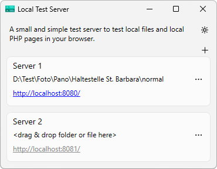

# Local Test Server
This small and light weight local test server enables you to test local files in your browser. The server supports php files and runs the php interpreter (if available). See .htaccess support below. You can create up to 5 servers, each server serves its own root folder. Click on `+` to add a new server.

To enable a server just drag & drop a folder or a file (usually a .html file) onto a server box (Server 1, Server 2, etc.). The root folder is then displayed in the server box. Drop a folder or a file onto a server's box:

- **Folder**: The folder is taken as the new root folder. The browser shows a listing of the content of that folder. You can click on any item (either navigate to a folder or open a file).

- **File**: The folder of the file is used as the root folder. The file is passed to the browser and opened. In case of a php file the file is interpreted first and the resulting html code is sent to the browser.

You can drop a folder or drop a file at any time onto an existing server. The server will take the root folder from that point on. A server is running as soon as it has a valid root folder.

The `...` button opens a menu that contains the last recently used folders and files (10 max). Additionally you can open the folder selection dialog.



The local test server supports the dark mode. It is multilingual and supports English and German.
### PHP Installation

The PHP installation is optional and not required. In order to install the PHP interpreter download the Windows binaries of the PHP interpreter (e.g. from https://windows.php.net/download/). Create a folder named `php` at the location of the local test server and copy the php runtime into this new folder. Ready.

### .htaccess Emulation

The .htaccess emulation is very basic and supports at the moment the most important commands. Most with limited features. But they serve the common use case to redirect any link to a file:

```
RewriteEngine on
RewriteCond %{REQUEST_FILENAME} !-f
RewriteRule ^(.*)$ /index.php
```

#### RewriteEngine
This command is fully supported. The syntax is:

`RewriteEngine on|off`

#### RewriteBase
This command is fully supported. The syntax is:

`RewriteBase <urlPath>`

#### RewriteCond
This command is the most limited at the moment and allows only fixed parameters. The syntax is:

`RewriteCond <testString> <condition> [<options>]`

*testString*: only `%{REQUEST_FILENAME}` is supported

*condition*: only `-f` is supported. The negation of the condition with a leading `!` is supported.

*options*: the option `OR` is supported

#### RewriteRule
A small subset of the features is supported. The syntax is:

`RewriteRule <regular expression> <substitution> [<options>]`

*regular expression*: any valid regular expression. The negation of the condition with a leading `!` is supported.

*substitution*: must be a local file, if the file doesn't start with a '/' the 'urlPath' from the 'RewriteBase' statement is prepended.

*options*: are ignored

